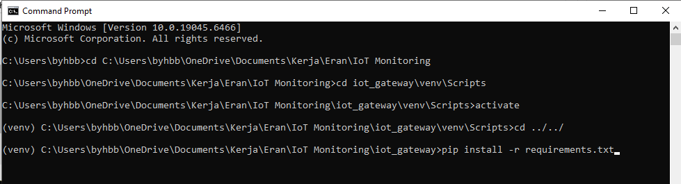
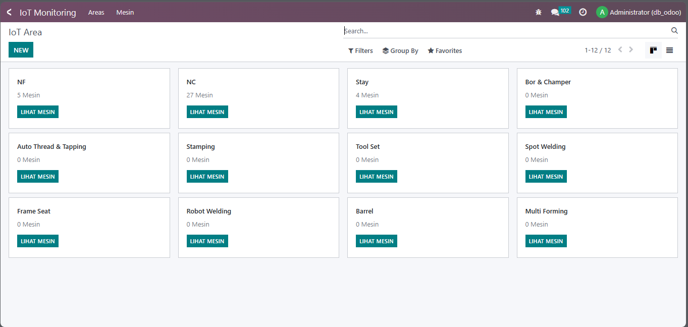
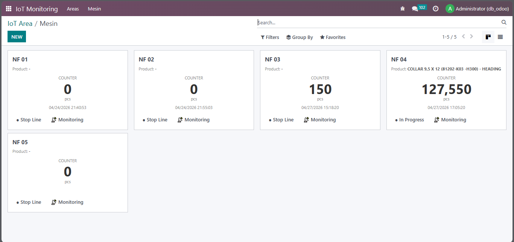
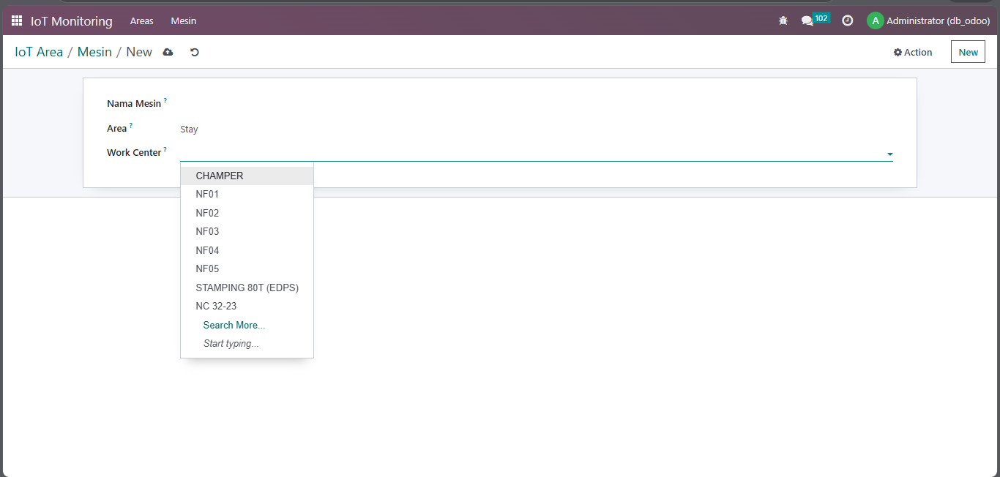
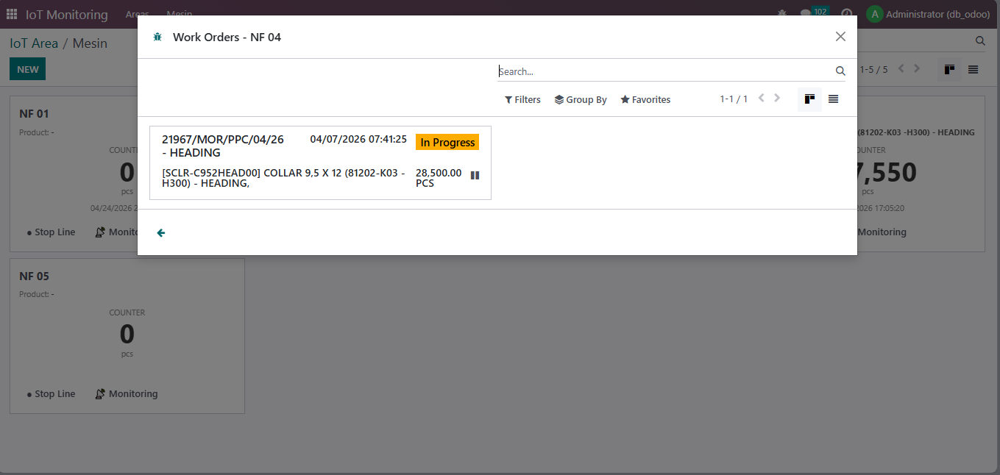
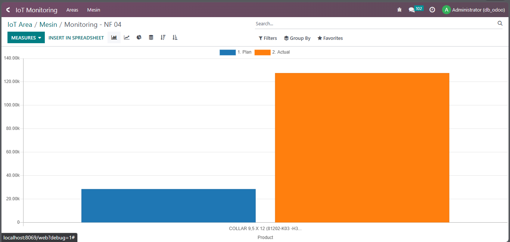

# 🚀 IoT Monitoring System (Odoo + PLC Integration)

Development Apps IoT Monitoring Odoo

---

## 🧠 Arsitektur Sistem

PLC → Gateway (Mini PC) → Buffer (SQLite) → Odoo

---

## 📦 Struktur Project

IoT Monitoring/
├── iot_monitoring   # Odoo Module (UI & Monitoring)
├── iot_gateway      # Gateway Python (PLC → Mini PC Gateway → Odoo)

---

## 🔹 1. iot_monitoring (Odoo Module)

Module Odoo untuk:

- Counter mesin (Kanban)
- Integrasi dengan Work Order (MRP)
- Grafik Plan vs Actual
- Status mesin (Running / Stop) sesuai Work Order

### 🔧 Install Module

1. Clone folder iot_monitoring ke addons_custom
2. Restart Odoo:

odoo-bin -c odoo.conf -d db_odoo -u iot_monitoring

3. Update Apps List
4. Install module

---

## 🔹 2. iot_gateway (Edge Gateway)

Gateway ini berjalan di Mini PC dan berfungsi untuk:

- Membaca data dari PLC (Modbus)
- Menghitung increment (delta counter)
- Menyimpan data sementara (buffer SQLite)
- Mengirim data ke Odoo (XML-RPC)
- Retry otomatis jika gagal

---

## ⚙️ Setup Gateway

Masuk ke folder:

cd iot_gateway

---

### 🔸 Aktifkan Virtual Environment

Windows:
venv\Scripts\activate

Linux/macOS:
source venv/bin/activate

---

### 🔸 Install Dependency

pip install -r requirements.txt

---

## ▶️ Menjalankan Gateway

python main.py

---

## 🧪 Testing Tanpa PLC

Edit file:

iot_gateway/core/modbus.py

Gunakan dummy:

import random

def read(self, register):
    return random.randint(0, 1000)

---

## 📡 Konfigurasi PLC

Edit file:

iot_gateway/config/machines.json

Contoh:

[
  {
    "code": "NF01",
    "ip": "192.168.1.10",
    "port": 502,
    "register": 100
  }
]

---

## 🧱 Fitur Sistem

- Multi PLC support
- Buffer (SQLite) untuk menghindari data loss
- Retry otomatis saat koneksi gagal
- Threading (multi mesin)
- Logging ke file

---

## ⚠️ Catatan Penting

- Gateway HARUS dijalankan dengan virtual environment aktif
- Jangan jalankan gateway di environment Odoo
- Pastikan Odoo server sudah berjalan
- Gunakan jaringan LAN untuk kestabilan
- Folder logs/ akan otomatis menyimpan log

---

## 🖼️ Screenshot Aplikasi

Area Produksi:

Counter Mesin:

Input Mesin:

MO Req:

Monitoring Graph:

---

## 💯 Status

✔ Ready for testing  
✔ Ready for deployment (Mini PC)  
✔ Scalable untuk multi mesin  

---

## 👨‍💻 Notes

Project ini terdiri dari dua komponen terpisah:

- Odoo Module → untuk visualisasi & business logic
- Gateway Python → untuk komunikasi dengan PLC

Keduanya terhubung melalui API (XML-RPC)
